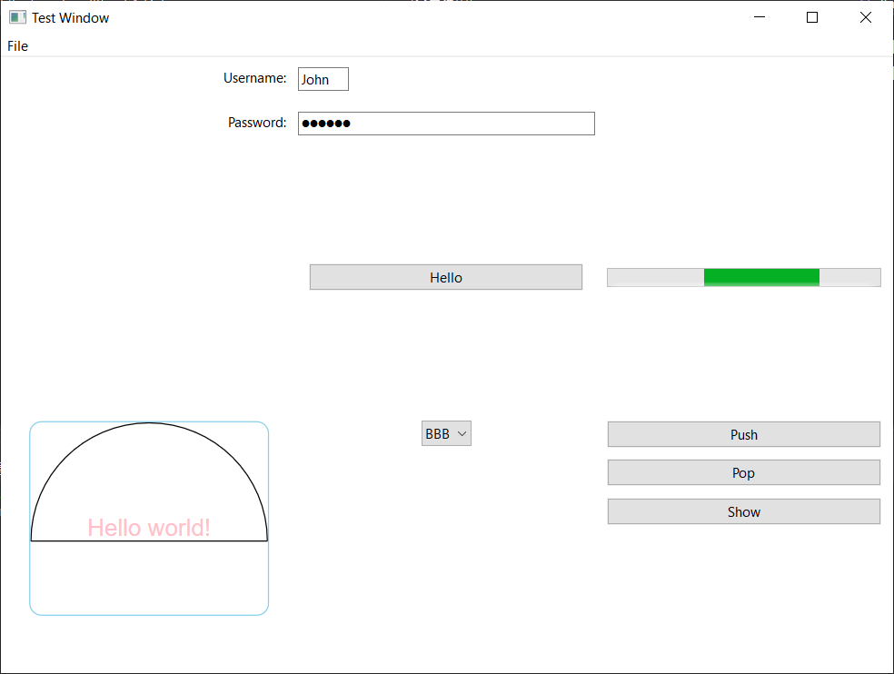
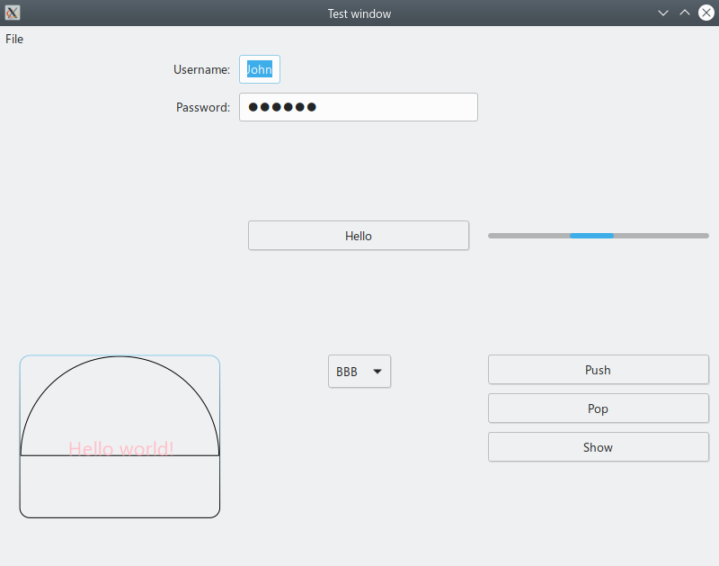
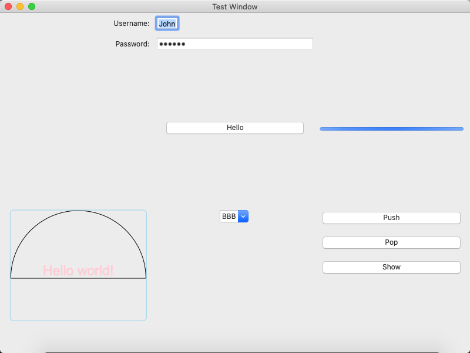
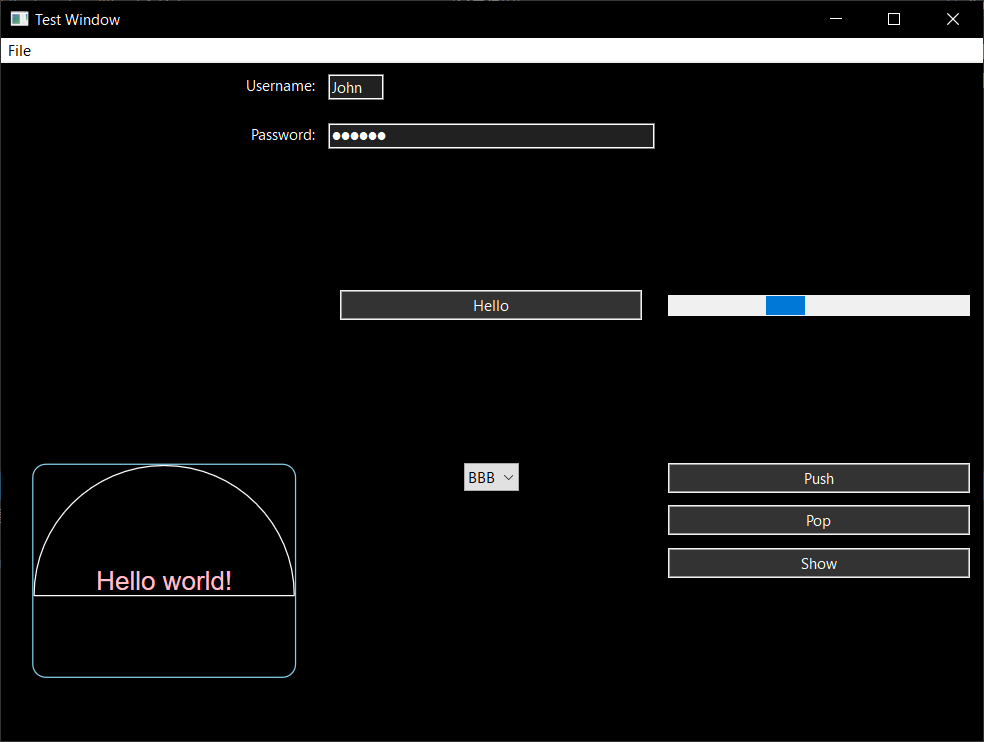
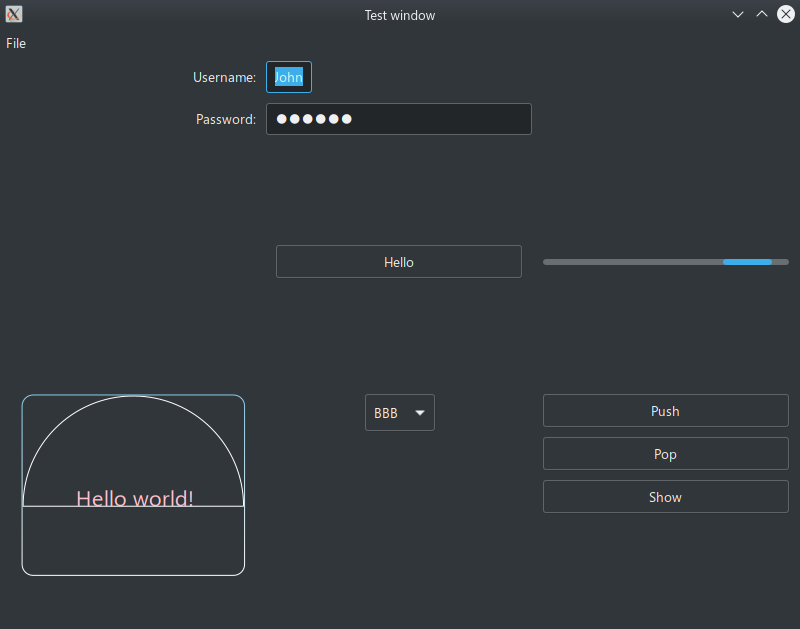
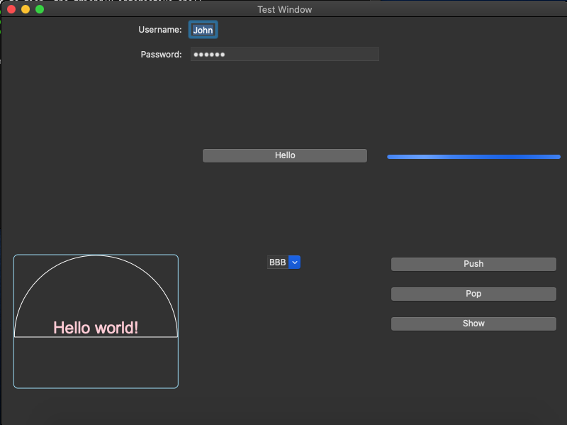

# XamlCpp
An implementation of XAML cross-platform framework for C/C++.

This project is NOT complete, and still needs a lot of work. Welcome issues and pull requests!

[](https://strawberry-vs.visualstudio.com/XamlCpp/_build?definitionId=12)
## Goal
The goal of XamlCpp is to write a cross-platfrom GUI application easily and quickly. It uses a dialect of XAML to discribe the UI, but may not support all features like other XAML frameworks do. The final application should be tiny, with a few dependencies, compared to Qt or so.

## Charset
XamlCpp uses UTF-8 everywhere, which is ensured by a modified version of `boost-nowide` on Windows.

## Reflection
XamlCpp supports reflection. All registered class could be constructed dynamically, and methods, properties and events registered could be accessed dynamically.

A simple example is [here](./meta/test/src/main.cpp).

It doesn't use the RTTI feature of C++, instead, it ownes an stable implementation, because the constraints of the standard are too loose to implement reflection.

The object model of XamlCpp is inspired by COM. The only difference is that COM uses `stdcall` for calling convention, but XamlCpp uses `cdecl`.

## GUI
XamlCpp is a cross-platform GUI framework. With some simple, platform-specific work, you can make your application run on all platforms supported.

An example is [here](./ui_controls/test/src/main.cpp)

GUI is divided into several parts.
The basic UI project is responsible for the main loop, windows and system dialogs. It is necessary to run a GUI application.

### Screenshots
|Platform|Win32|GTK+3|Cocoa|
|-|-|-|-|
|Light||||
|Dark||||

\* Due to API limitation, dark mode for Win32 is not completed.

### UI
It supports desktop environment with concepts of "window" and "screen", and many dialogs like "message box" and "file box".
It also supports high DPI settings even on Windows.
#### Supported platforms
|Name|API set|Supported OS|Recommanded OS|
|-|-|-|-|
|Win32|Windows API|Windows\*|Windows|
|GTK+3|GLib, Gdk, Gtk|Windows, Linux, MacOS|Linux, Windows/MinGW|
|Cocoa|Cocoa|MacOS|MacOS|

\* At least Windows 7.

### Controls
Common controls, works on all platforms.

### Canvas
A canvas control.
#### Supported platforms
|Name|API set|
|-|-|
|Win32|Direct2D|
|GTK+3|Cairo|
|Cocoa|NSGraphicsContext|

### WebView
A webview control.
#### Supported platforms
|Name|API set|
|-|-|
|Win32|Edge(Chromium) -> Edge -> IE \*|
|GTK+3|Webkit \*\*|
|Cocoa|WebKit|

\* Indicates the search order. IE is supported to ensure it could be used.

\*\* Linux only because of the limitation of webkit2gtk.

## XAML
XamlCpp uses a dialect of XAML, which may support XAML Standard in the future. XAML files are either interpreted at run-time, or compiled to C++ code at compile-time.

Here's an XAML example:
``` xml
<window xmlns="https://github.com/Berrysoft/XamlCpp/"
        xmlns:x="https://github.com/Berrysoft/XamlCpp/xaml/"
        title="Test Window" location="200, 100" size="800, 600">
  <grid margin="10" columns="1*, 0.8*, 1*" rows="1*, auto, 1*">
    <label x:name="mylabel" grid.column="0" grid.row="1" margin="5, 0" text_halignment="right" valignment="center" text="{binding text,element=mybutton,mode=one_way}"/>
    <button x:name="mybutton" grid.column="1" grid.row="1" click="on_button_click">Hello</button>
    <canvas grid.column="0" grid.row="2" margin="10" redraw="on_canvas_redraw"/>
  </grid>
</window>
```
The `xmlns` should be `https://github.com/Berrysoft/XamlCpp/` to use default controls. The xml attributes decribes the properties, events and attach properties of a control.

The XAML parser uses a modified version of [rapidxml_ns](https://github.com/svgpp/rapidxml_ns). It is modified to use features of C++ 17 and simplified to support UTF-8 only for convenience.

## Detector
XamlCpp provides a detector called `xmald` to show the reflection infomation of a dynamic library for XamlCpp.

## Resource
XamlCpp provides a resource compiler called `xamlrc`, to embed small files into the final program. It supports UTF-8 only.

## Build
A C++17-compliant compiler is required. Actually it needs C++20, but no compiler is compliant...

This project assumes it is built by GCC 10.0+ or Clang 10.0+ when using GNU or LLVM toolchains.
### Build on Windows
#### MSVC
`wil` and `boost-multi-index` are required. `vcpkg` is recommanded for installing. Other packages will be downloaded from NuGet when configuring.
#### MinGW
`gtk`, `pkgconfig` and `boost` are required. MSYS2 is recommanded for installing and building.

It is not possible now to build target Windows API with MinGW toolchain, because `wil` isn't supported by GCC or Clang/MinGW.
### Build on Linux
`gtk`, `webkit2gtk` and `pkgconfig` are required.
### Build on Mac
Mac OS 10.15+ is required for some C++17 features (`<any>` and `<filesystem>`)

`boost` is required.
#### Cocoa
No other package is needed.
#### Gtk
`gtk` and `pkgconfig` are also required.
