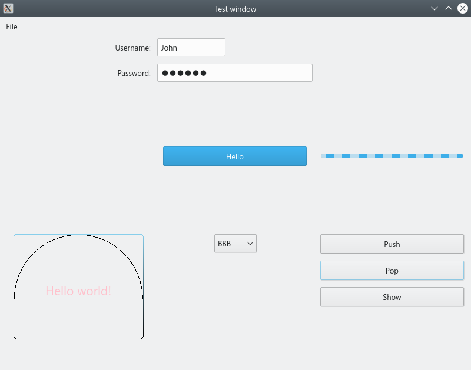
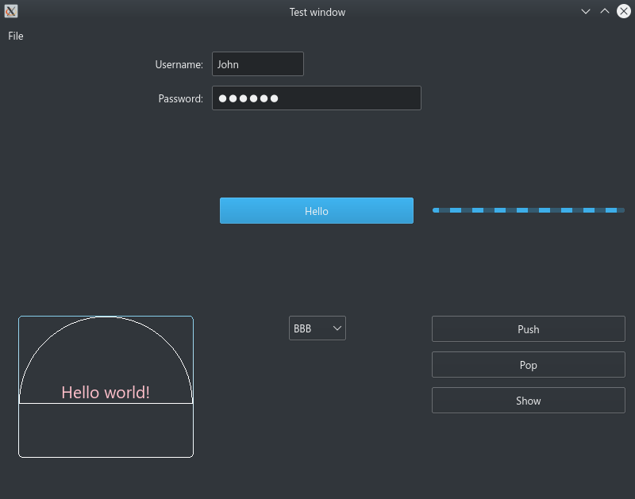

# XamlCpp
An implementation of XAML cross-platform framework for C/C++.

This project is NOT complete, and still needs a lot of work. Welcome issues and pull requests!

[](https://strawberry-vs.visualstudio.com/XamlCpp/_build?definitionId=12)
## Goal
The goal of XamlCpp is to write a cross-platfrom and cross-language\* GUI application easily and quickly. It uses a dialect of XAML to discribe the UI, but may not support all features like other XAML frameworks do. The final application should be tiny, with a few dependencies.

\* At first, I only want to target C++, and that's why it is called Xaml**Cpp**. Now it also targets C, with Rust and C#, in principle.

## Charset
XamlCpp uses UTF-8 everywhere, which is ensured by a modified version of `boost-nowide` on Windows.

## Object Model and Reflection
The object model of XamlCpp is inspired by COM. But there are some difference:
* COM uses `stdcall` for standard calling convention, while XamlCpp uses `cdecl` on Windows.
* In most cases, COM needs a server to manage the classes and memory, but XamlCpp needs not.
* COM distinguishes classes and interfaces. XamlCpp only provides interfaces, and the implementations could only be constructed by specified functions.
* COM uses `PascalName`, while XamlCpp uses `snake_name`.

But there are many more similarities. For example, the definition of `xaml_result` is the same as `HRESULT`, and even the value means the same; both of them don't use exceptions; the object model looks like the same, and some GUIDs of primitive types is the same as .NET(which WAS COM+ at first).

Writing a class for XamlCpp is more complicated than a normal C++ class, but simpler than COM. You don't need `idl` files and non-standard keywords, but predefined helper macros. Such a definition of the interface could be easily projected to C, Rust and C#, which means different languages could cooperate (maybe not that?) easily.

XamlCpp supports reflection by this object model. All registered class could be constructed dynamically, and methods, properties and events registered could be accessed dynamically. Note that reflection is not free nor type-secure. Programmers are responsible for the cost and type checking, and any type mismatch is undefined behavior.

A simple example is [here](./meta/test/src/main.cpp).

## GUI
XamlCpp is a cross-platform GUI framework. With some simple, platform-specific work, you can make your application run on all platforms supported.

An example is [here](./ui_controls/test/src/main.cpp)

GUI is divided into several parts.
The basic UI project is responsible for the main loop, windows and system dialogs. It is necessary to run a GUI application.

### Screenshots
|Platform|Light|Dark|
|-|-|-|
|Win32|||
|GTK+3|||
|QT5|||
|Cocoa|||

\* Due to API limitation, dark mode for Win32 is not completed.

\*\* Screenshots of Gtk and Qt is captured on KDE with theme Breeze.

### UI
It supports desktop environment with concepts of "window" and "screen", and many dialogs like "message box" and "file box".
It also supports high DPI settings even on Windows.
#### Supported platforms
|Name|API set|Supported OS|Recommanded OS|
|-|-|-|-|
|Win32|Windows API|Windows\*|Windows|
|GTK+3|GLib, Gdk, Gtk|Windows, Linux, MacOS|Windows/MinGW64, Linux|
|QT5|Qt5Widgets|Windows, Linux, MacOS|Windows, Linux, MacOS|
|Cocoa|Cocoa|MacOS|MacOS|

\* At least Windows 7.

### Controls
Common controls, works on all platforms.

### Canvas
A canvas control.
#### Supported platforms
|Name|API set|
|-|-|
|Win32|Direct2D|
|GTK+3|Cairo|
|QT5|QPainter|
|Cocoa|NSGraphicsContext|

### WebView
A webview control.
#### Supported platforms
|Name|API set|
|-|-|
|Win32|Edge(Chromium) -> Edge -> IE \*|
|GTK+3|Webkit \*\*|
|QT5|Qt5WebEngine or Qt5WebKit \*\*\*|
|Cocoa|WebKit|

\* Indicates the search order. IE is supported to ensure it could be used.

\*\* Linux only because of the limitation of webkit2gtk.

\*\*\* Could be specified in configuration.

## XAML
XamlCpp uses a dialect of XAML, which may support XAML Standard in the future. XAML files are either interpreted at run-time, or compiled to C++ code at compile-time.

Here's an XAML example:
``` xml
<window xmlns="https://github.com/Berrysoft/XamlCpp/"
        xmlns:x="https://github.com/Berrysoft/XamlCpp/xaml/"
        title="Test Window" location="200, 100" size="800, 600">
  <grid margin="10" columns="1*, 0.8*, 1*" rows="1*, auto, 1*">
    <label x:name="mylabel" grid.column="0" grid.row="1" margin="5, 0" text_halignment="right" valignment="center" text="{binding text,element=mybutton,mode=one_way}"/>
    <button x:name="mybutton" grid.column="1" grid.row="1" click="on_button_click">Hello</button>
    <canvas grid.column="0" grid.row="2" margin="10" redraw="on_canvas_redraw"/>
  </grid>
</window>
```
The `xmlns` should be `https://github.com/Berrysoft/XamlCpp/` to use default controls. The xml attributes decribes the properties, events and attach properties of a control.

The XAML parser uses a modified version of [rapidxml_ns](https://github.com/svgpp/rapidxml_ns). It is modified to use features of C++ 17 and simplified to support UTF-8 only for convenience.

## Detector
XamlCpp provides a detector called `xmald` to show the reflection information of a dynamic library for XamlCpp.

## Resource
XamlCpp provides a resource compiler called `xamlrc`, to embed small files into the final program. It supports UTF-8 only.

## Build
A C++17-compliant compiler is required. Actually it needs C++ 20, but no compiler is compliant...

This project assumes it is built by MSVC 19.27+, GCC 10.0+ or Clang 10.0+.

`boost` is required on all platforms for `cmdline`.

### Build for Win32
`wil` is required. Other packages will be downloaded from NuGet when configuring.
### Build for GTK+3
#### MSVC
`gtk` is required.
#### MinGW64 & Linux & MacOS
`gtk` and `pkgconfig` are required. `webkit2gtk` is also required on Linux for `webview`.
### Build for QT5
`qt5-base` is required. Either `qt5-webengine` or `qt5-webkit` is also required for `webview`.
### Build for Cocoa
No other package is needed.
